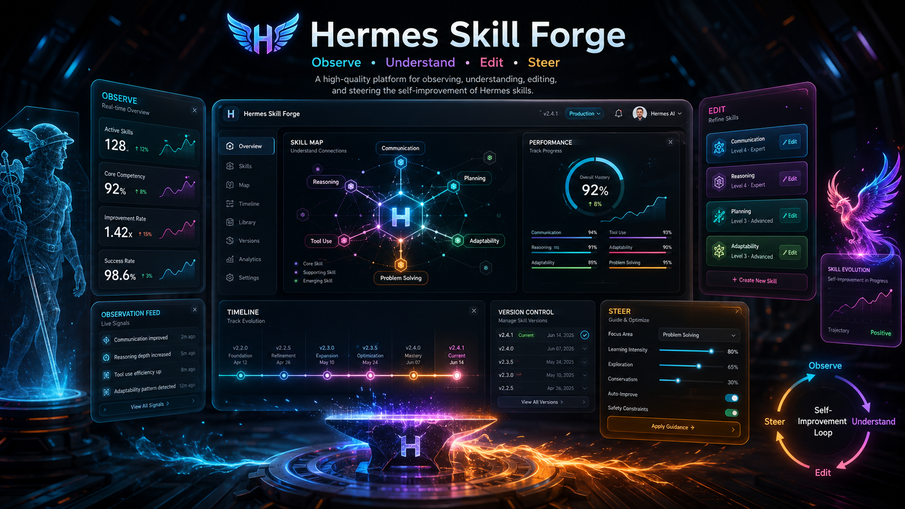
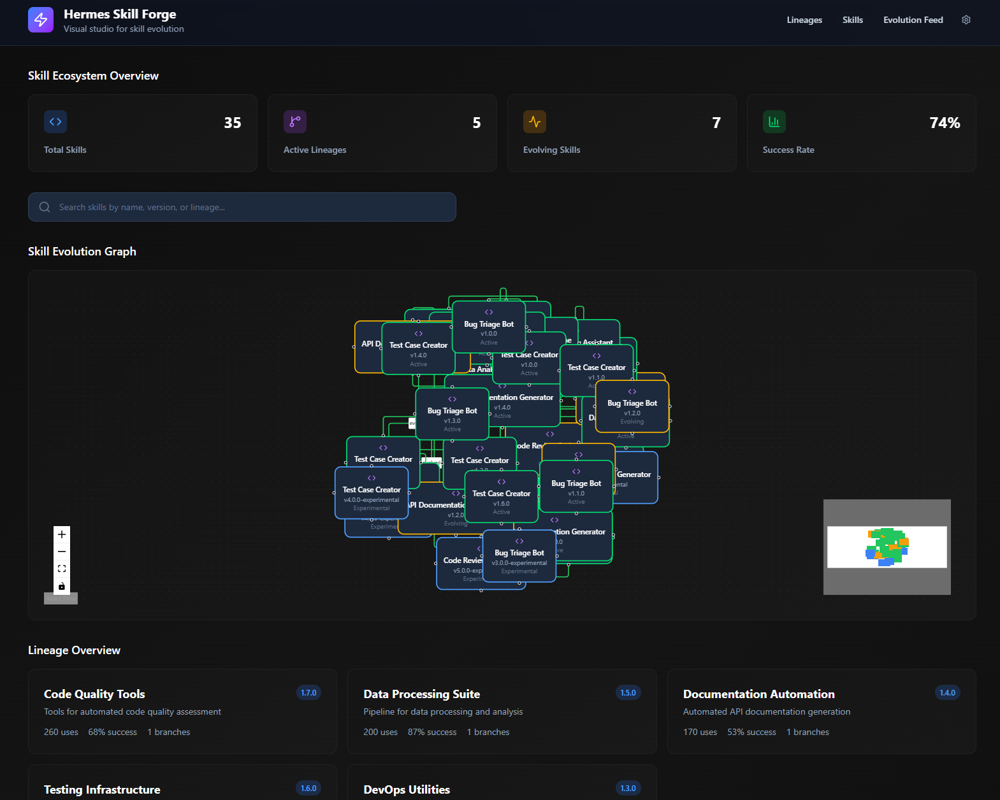

# Hermes Skill Forge

<div align="center">
  
</div>

> Visual studio for observing, understanding, editing, and steering Hermes skill evolution.

Hermes Skill Forge is an open-source tool that makes Hermes' unique strength —
continuous skill creation and evolution — tangible, inspectable, and collaborative.
Watch skills being born, improved, branched, and refined in real time.

## Features

### Skill Evolution Graph
Interactive visualization of skills and their relationships. Clear visual
distinction between core skills, evolved variants, experimental branches, and
deprecated versions.

### Version Timeline & Diff Experience
Beautiful timeline of a skill's evolution history with high-quality code diffs
between versions.

### Skill Inspection & Editing
Detailed view of a skill's code, metadata, and performance. Manual editing,
branching, and evolution requests.

### Evolution Activity Feed
Real-time stream of skill-related events with contextual links.

### Export & Packaging
Clean export of skills as reusable packages for other Hermes users.

## Screenshot



## Quick Start

```bash
# Clone the repository
git clone https://github.com/smfworks/hermes-skill-forge.git
cd hermes-skill-forge

# Install dependencies
npm install

# Start the development server
npm run dev

# Open http://localhost:3000
```

## License

MIT License - see [LICENSE](LICENSE) for details.
